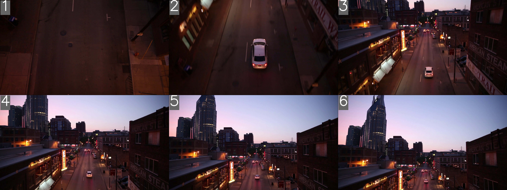

# videoframer

`videoframer` is a Python module for extracting video frames and creating image mosaics like the image above.

One of its application areas are LLMS with vision abilities. A single prompt with consecutive images can give temporal information to an LLM.

## Usage example

The above image was created as follows:

```python
from videoframer import VideoSampler, Tiler

## Use the VideoSampler class to sample frames from a video
video_sampler = VideoSampler("test_files/example_video.mp4")
video_sampler.sample_fixed_n(n_frames=6, t_start=0, t_end=6)  # Sample fixed amount of 

## Use the Tiler class to create a mosaic from the sampled frames
tiler=Tiler(video_sampler.to_array()) # expect list of arrays or folder (set from_folder=True)
mosaic = tiler.create_mosaic(n_rows=2, border_size=3, annotation_style='number', annotation_position='topleft')
tiler.save_mosaic_to_image(mosaic, "test_files/mosaic.jpg")
```

Other options:

```python   
# Sample frames at a fixed sampling rate
video_sampler.sample_fixed_rate(sample_rate=1, t_start=0, t_end=6) 

# Optional: Resize mosaic to fit in a certain size
mosaic = tiler.resize_mosaic(mosaic, 800, 600) 
```

## Installation
To install, clone this repository and install opencv and numpy.
   ```bash
   git clone https://github.com/tomdries/videoframer.git
   pip install -r requirements.txt
   ```


## Contributing

Contributions are always welcome! Fork and create a pull request to add your own features or fix bugs.

## License

This project is licensed under the [MIT License](LICENSE).
